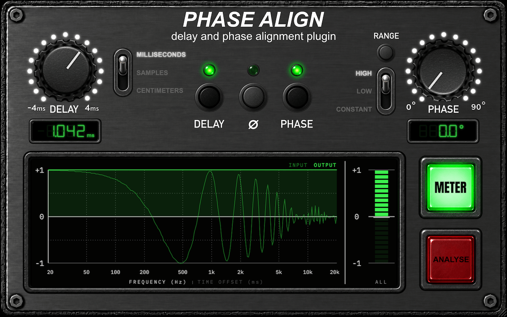
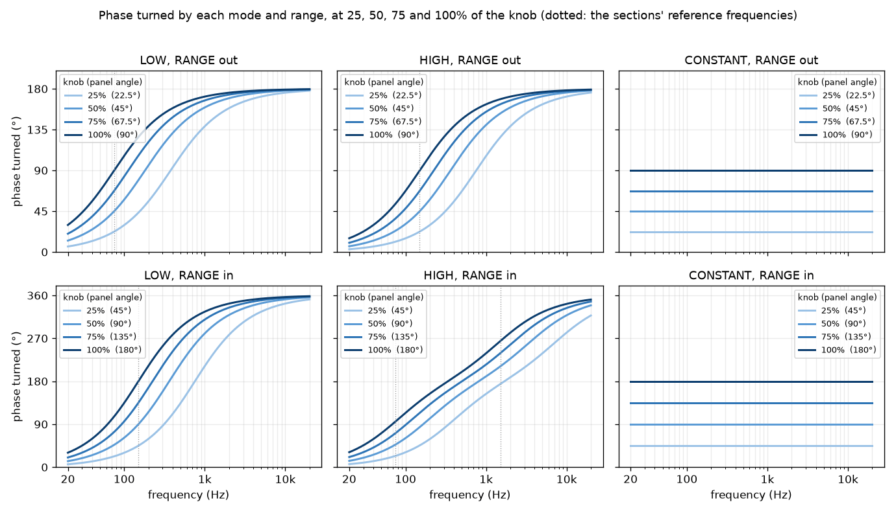
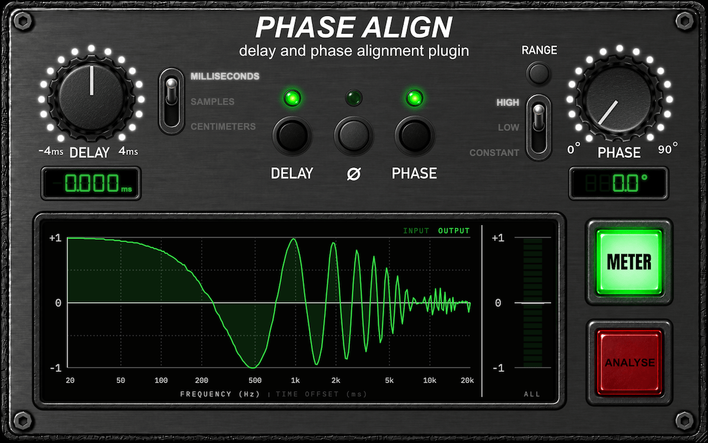
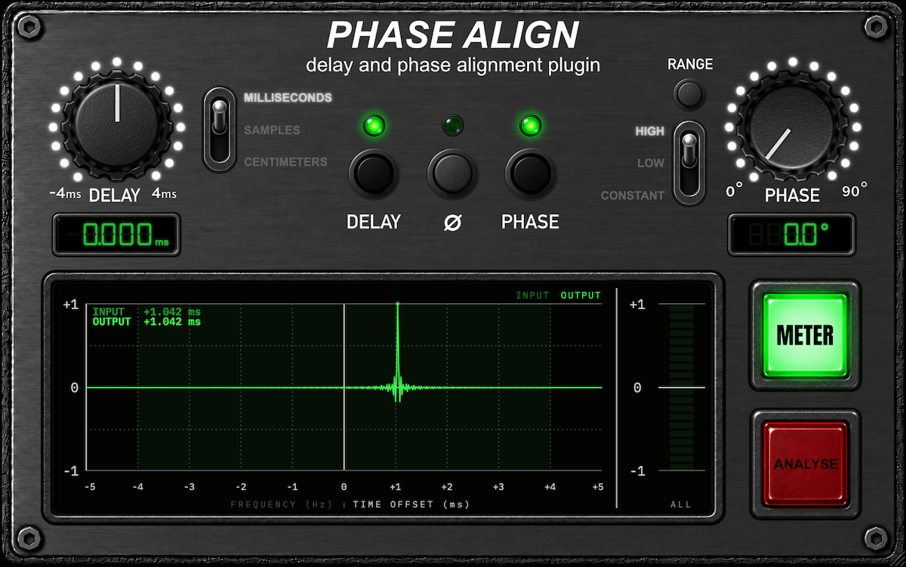
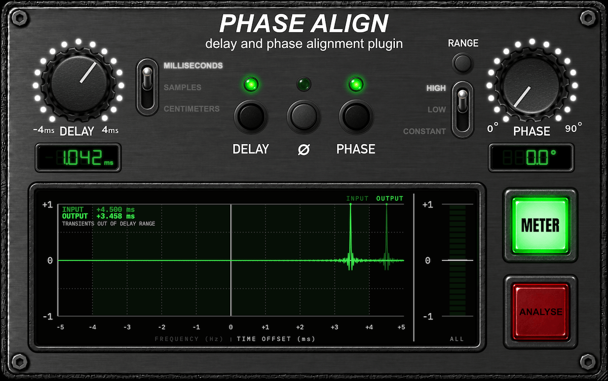

# Phase Align


[](https://opensource.org/license/agpl-v3)
[](https://somsubhra.github.io/github-release-stats/?username=tehguitarist&repository=PhaseAlign&page=1&per_page=30)



Phase Align is a free, open-source phase and time alignment plugin (AU and VST3) for lining up two tracks that capture
the same source: a close mic and a room mic, a DI and an amp, the top and bottom of a snare. It has a delay (−4 to
+4 ms in 0.1-sample steps), a phase rotation (all-pass or constant), a polarity flip, and a correlation meter that
compares your track with another one, so you can see the alignment as well as hear it. Inspired by phase alignment
tools like the Little Labs IBP.

**[⬇ Download the latest release](https://github.com/tehguitarist/PhaseAlign/releases/latest)**

macOS (Apple silicon and Intel; AU and VST3), Windows (VST3) and Linux (VST3). Mono and stereo tracks; stereo is
processed linked, so both channels get the same treatment.

- [Quick start](#quick-start)
- [The controls](#the-controls)
- [The phase modes](#the-phase-modes)
- [Reading the meter](#reading-the-meter)
- [Which control for which problem](#which-control-for-which-problem)
- [Latency and automation](#latency-and-automation)
- [How it works](#how-it-works) (the technical part)
- [Build](#build), [Release](#release), [Licence](#licence)

## Quick start

*Draft (2026-10-06); host routing steps still to be checked in each host.*

Phase Align lines one track up with another (two mics on one source, a DI and an amp, a close and a room mic). Put
it on one of the pair and feed the other into its **sidechain**; the meter then shows how well they agree.

1. **Insert Phase Align on one track** of the pair and route the **other track to its sidechain**:
   - Logic: the plugin window's *Side Chain* menu → the other track.
   - Live: in the device, set the sidechain input (*Audio From*) to the other track.
   - Reaper: give the track 4 channels, send the other track to channels 3/4, and map them to the sidechain inputs in
     the plugin's pin connector.
   - Cubase/Nuendo: enable the plugin's side-chain button and add a side-chain send from the other track.
   - Studio One and Bitwig: pick the other track in the plugin's sidechain selector.
2. **Time first.** Switch to the meter's **TIME OFFSET** view. The INPUT reading is how far apart the two tracks are
   (positive: the sidechain is later). Turn **DELAY** on and set the knob to that reading; the OUTPUT peak moves to
   0 ms. The delay reaches −4 to +4 ms, so it can move this track either way. Beyond that the screen says **TRANSIENTS
   OUT OF DELAY RANGE**: move a clip in the DAW first.
3. **Then phase.** Switch to the **FREQUENCY** view and turn **PHASE** on. The bright curve (processed) should sit at
   +1 across the band. **LOW** and **HIGH** rotate like an all-pass (under 1 ms of latency): LOW centres the turn lower down in
   frequency, HIGH higher up (and, with RANGE in, spread wider); **CONSTANT** turns every frequency by the same angle.
   **RANGE** out is one section (finer); pressed in it is two (a wider turn).
4. **Polarity (Ø)** inverts the track if the curve sits near −1 everywhere.
5. Check by ear: solo the pair and listen for the low end filling in.

**Latency.** HIGH and LOW add 0.7 ms at 44.1 kHz (0.4 ms at 48 kHz, almost none at 96 kHz and up), so their sections
behave the same at every sample rate; Constant adds about 43 ms instead. The delay adds about 4 to 4.5 ms while it is on
(depending on the sample rate), so it can go negative. All of it is reported to the host, which compensates. Switching the delay or entering or leaving
Constant fades the audio out and back in over about 20 ms; some hosts only re-align at the next transport start.

## The controls

The panel has three parts: the **delay** section on the left, the **phase** section on the right, and the **meter**
along the bottom. Each section has its own on/off button, and a section that is off dims its controls (they still
work, so you can set them up before switching them on).

### Delay (left)

| Control | What it does |
|---|---|
| **DELAY knob** | Moves this track earlier or later by −4 to +4 ms, in steps of 0.1 sample, with no change to its tone. Use it for tracks recorded at different distances. |
| **DELAY button** | Turns the delay on or off. The LED is lit when it's on. While it's on the plugin adds a few milliseconds of latency so it can reach negative delays too; the host compensates (see [Latency](#latency-and-automation)). |
| **Unit switch** | Shows the delay as **milliseconds**, **samples** or **centimetres** (of sound travel at 343 m/s, so 4 ms is about 137 cm). It only changes the readout and how typed values are read; the setting is stored in milliseconds, so a session behaves the same at any sample rate. |
| **Readout** | The delay actually applied, in the chosen unit. Double-click it to type a value. |

### Polarity (centre)

| Control | What it does |
|---|---|
| **Ø button** | Inverts the track (a 180° flip). The LED is lit when it's inverted. It works whether the phase section is on or not. Together with the phase knob it covers a full 360°. |

### Phase (right)

| Control | What it does |
|---|---|
| **PHASE knob** | How far to rotate the phase, from 0° (no change) up to 90° (RANGE out) or 180° (RANGE in). |
| **PHASE button** | Turns the phase section on or off. |
| **Mode switch** | (See [The phase modes](#the-phase-modes) for how each works.) **HIGH** and **LOW** are all-pass rotations: the phase shift changes with frequency, growing as you go up the spectrum. They differ in where the middle of the turn sits. **LOW** centres it lower down: around 75 Hz with RANGE out, around 150 Hz with RANGE in (two sections stacked on top of each other). **HIGH** centres it higher up: around 150 Hz with RANGE out, around 340 Hz with RANGE in (two sections spread apart, one near 75 Hz and one near 1.5 kHz, so the turn is also more spread out). **CONSTANT** turns every frequency by the same angle, which is a true phase rotation, at the price of about 43 ms of latency. |
| **RANGE button** | Out (the default) runs one section over the knob's travel, for finer control. Pressed **in**, it runs two sections for a wider turn. The knob keeps its position when you press it. The scale label above the knob shows the largest number the knob now reads, 90° or 180°; in HIGH with RANGE in it reads **90°\***, because the number is then the first section's angle (the second section adds its own turn higher up). |
| **Readout** | The rotation in degrees (an asterisk where it is the first section's angle, as above). Double-click to type a value. |

### Meter (bottom)

| Control | What it does |
|---|---|
| **METER button** | Turns the meter on or off. When it's off (or the window is closed) the meter does no work at all, which saves CPU. |
| **FREQUENCY / TIME OFFSET** | Click either label under the screen to switch views. See [Reading the meter](#reading-the-meter). |
| **ANALYSE** | Reserved for a future automatic-suggestion feature. It doesn't do anything yet. |

### Using the knobs

| Gesture | Effect |
|---|---|
| Drag up or down | Turn the knob. |
| Shift-drag | Fine control (a tenth of the speed). |
| Mouse wheel, or the arrow keys | Delay: one sample (a tenth of a sample with Shift). Phase: 0.5°. |
| Double-click the readout | Type a value. |
| Cmd-click or Alt-click | Reset to the default. |
| Hover | A tooltip says what the control does and its units, including the latency a setting adds. |

Everything can be automated except the DELAY button and the HIGH / LOW / CONSTANT switch, because changing either one changes the latency.

## The phase modes

The PHASE section turns the phase of a track without changing its level. **HIGH** and **LOW** do it with all-pass
filters, which turn each frequency by a different amount; **CONSTANT** turns every frequency by the same angle.
**RANGE** doubles the reach. The figure shows what each of the six settings does to the phase across the spectrum, at a
quarter, half, three-quarters and the full turn of the knob.



### HIGH and LOW: all-pass sections

Each section is a first-order all-pass. It turns the phase from 0° at the lowest frequencies up to 180° at the top, with
most of the turn happening around its *corner* frequency. The knob moves that corner. At 0° the corner is far above the
audible band, so nothing changes; as you turn the knob up the corner sweeps down through the spectrum, turning more and
more of it. Where a filter's corner sits decides which part of the spectrum gets the turn, and that is what separates the
modes. The dotted lines in the figure mark each setting's *reference frequency*, where the number on the panel is
measured.

| | RANGE out (one section, finer) | RANGE in (two sections, wider) |
|---|---|---|
| **LOW** | One section, referenced at **75 Hz**. | Two sections **stacked** at 150 Hz, so the same corner turns twice as far: a steep turn that stays on the lows. |
| **HIGH** | One section, referenced at **150 Hz**, an octave above LOW's. | Two sections spread apart, one on the lows (**75 Hz**) and one on the highs (**1.5 kHz**): a wider, shallower turn across the whole spectrum. |

### Where the turn sits

What separates LOW from HIGH is **where the middle of the turn sits**: the frequency where half of the full turn has
happened. At full knob:

| | RANGE out (turns 180° in all) | RANGE in (turns 360° in all) |
|---|---|---|
| **LOW** | **75 Hz** (90° have turned) | **150 Hz** (180° have turned) |
| **HIGH** | **150 Hz** | about **340 Hz** |

So **LOW centres the turn lower down and HIGH higher up**, with RANGE out or in. With RANGE in, HIGH is also more
spread out: LOW's stacked sections turn steeply and are nearly finished by 1 kHz (326° of 360°), while HIGH's spread
sections keep turning through the highs (239° at 1 kHz, 325° at 5 kHz). Turning the knob down moves the middle of the
turn up in frequency, so a quarter turn of LOW is centred well above 75 Hz.

### CONSTANT: a true rotation

CONSTANT turns every frequency from about 20 Hz upwards by the same angle, which an all-pass can't do (the flat lines in
the figure). It costs about 43 ms of latency, which the host compensates. The angle is 0 to 90° with RANGE out or 0 to 180° with RANGE in,
and the rotation is that angle at every frequency across the audible band, to a fraction of a degree.

### What the number means

The readout is the phase turned at the setting's reference frequency (the dotted line), so at full travel it reads 90° with
RANGE out and 180° with RANGE in, and a reading of, say, 45° means 45° of phase turned at that frequency. HIGH with
RANGE in is the one exception. Its two sections are far apart, so there's no single frequency at which the whole turn is 180°.
It reads 0–90° with an **asterisk**, which is the angle of its first section (the true phase at 75 Hz is a few degrees
more, about 96° at full travel). The full 180° of its total turn arrives around 340 Hz, and it keeps climbing towards
360° at the top.

The knob keeps its position when you press RANGE, so in LOW and CONSTANT the number doubles or halves, and in HIGH it
keeps its value and gains or loses the asterisk. Pressing RANGE or switching mode glides the sections over about 30 ms
rather than jumping.

### Choosing one

A reasonable way in, using the FREQUENCY meter view: if the two tracks only disagree in the bass, try **LOW**; if the
disagreement carries up through the mids, try **HIGH**; press RANGE in when 90° doesn't reach far enough; use
**CONSTANT** when you want the same angle at every frequency, or to nudge a track by a few degrees across the whole
band. Set the **delay** first, and flip **Ø** if the curve sits near −1 everywhere.

## Reading the meter

The meter compares the track Phase Align is on with the track in its **sidechain**. It shows a correlation, *r*, which
is **+1** when the two agree perfectly, **0** when they are unrelated, and **−1** when one is the exact opposite of the
other. Both tracks need to be playing the same source at the same time; the meter settles within about a second.

Each view draws two things: the **INPUT** (what the pair looks like without Phase Align, dim) and the **OUTPUT** (with
it, bright), so "better or worse" is the gap between them.

### FREQUENCY view



*r* at each frequency from 20 Hz to 20 kHz. Two mics at different distances make the curve swing up and down (a comb
filter); a polarity problem pulls the whole curve toward −1. The goal is a bright curve sitting at +1. The bar on the
right is the single overall figure for the whole band: lit segments for the output, a tick for the input.

### TIME OFFSET view



Where the two tracks line up, from −5 ms to +5 ms. A single sharp peak is the delay between the tracks, and the peak's
position is printed next to INPUT and OUTPUT (positive means the sidechain is later). The part the delay knob can reach
(−4 to +4 ms) is shaded. After you set the delay (or the right phase), the OUTPUT peak should move to 0 ms.

If the peak is outside the delay's reach, the screen says **TRANSIENTS OUT OF DELAY RANGE** and shows the offset:



Move one of the clips in your DAW by that amount first (up to ±40 ms is detected), then fine-tune with the delay.

### Messages

- **NO SIDECHAIN SIGNAL**: nothing is routed to the sidechain, or it has been silent for more than a second.
- **OFF**: the METER button is off.

## Which control for which problem

- **Two mics at different distances** (close and room, a stereo pair against a spot mic): a *time* difference. Use the
  **delay**. Phase rotation can't fix it properly, because a delay turns each frequency by a different amount
  (higher frequencies more) and an all-pass doesn't follow that.
- **A DI and a mic'd amp, or a mic's own phase response**: no simple delay between them. Use the **phase** section;
  try HIGH and LOW and watch the FREQUENCY view. If you want the same shift at every frequency, use **CONSTANT**.
- **Top and bottom snare mics, or a kick's inside and outside mics**: usually opposite polarity. Press **Ø** first.
- **Both together**: set the delay first (TIME OFFSET view), then the phase (FREQUENCY view), then check the polarity.

## Latency and automation

- **HIGH and LOW** add 32 samples at 44.1 kHz, 18 at 48 kHz, 5 at 96 kHz and none at 192 kHz (0.7 ms, 0.4 ms, 0.05 ms
  and 0), so they behave the same at every sample rate.
- **CONSTANT** adds about 43 ms, at every sample rate.
- **The delay** adds about 4 to 4.5 ms while DELAY is on, depending on the sample rate, because a negative delay needs
  the rest of the signal to wait.
- All of it is reported to the host, which compensates. When the latency changes (DELAY on or off, entering or leaving
  CONSTANT) the audio fades out and back in over about 20 ms, and some hosts only re-align at the next transport start.
  Other changes (moving a knob, PHASE on or off, Ø) crossfade smoothly over about 50 ms.
- Bypassing the plugin in the host keeps its latency, so nothing shifts.

## How it works

This part is for the curious; none of it is needed to use the plugin.

**Signal flow.** Input → polarity → phase → delay → output. These are all linear, so their order doesn't change the
result. The meter reads the input and output of this chain and the sidechain, and doesn't change the audio.

**All-pass phase (HIGH and LOW).** A first-order all-pass filter changes phase but not level: it shifts 0° at DC
towards 180° at Nyquist, and the corner frequency decides where in the spectrum the turn happens. The knob angle θ is
the shift at a reference frequency, and above it the shift keeps growing, the way any all-pass behaves. One section runs
from 0° at the bottom of the spectrum to 180° at the top; RANGE in adds a second section, which doubles the turn available.

| Mode | RANGE out | RANGE in |
|---|---|---|
| LOW | one section; the angle is its shift at 75 Hz | two stacked sections; the angle is their combined shift at 150 Hz, 0–180° |
| HIGH | one section; the angle is its shift at 150 Hz | two sections, at 75 Hz and about 1.5 kHz; the number is the first section's angle, 0–90° |

With RANGE in the two sections share the knob's whole travel. Pressing RANGE or changing mode glides the sections from
one shape to the other over about 30 ms. More knob never means less phase at any frequency; the knob starts at exactly
0° (no change) and every part of its travel does something. The corners are fixed in Hz at every sample rate, and
the sections are in direct form I, which stays quiet when the knob moves.

**Matching an analogue all-pass.** A digital all-pass squeezes its shift towards Nyquist ("cramping"), so near the top
of the spectrum a plain version drifts away from an analogue one. HIGH and LOW therefore run oversampled (4× below 85 kHz, 2× below 170 kHz) between
linear-phase half-band filters, which keeps them within about 2.5° of an analogue all-pass to 20 kHz at every sample
rate (about 5° for LOW with RANGE in, whose two stacked sections double the error), at the cost of the small latency listed above. A zero-latency version can't do this (it follows from Foster's
reactance theorem).

**True rotation (CONSTANT).** The signal goes through a Hilbert transformer, which produces the signal and a copy
turned 90° at every frequency; mixing them with sine and cosine of the angle rotates the phase by exactly θ everywhere.
The transformer is a 4097-tap linear-phase FIR at 48 kHz (the length scales with the sample rate), run with a
zero-latency partitioned convolver, plus a matching delay: the 43 ms or so.

**The delay.** Fractional delay uses windowed-sinc interpolation (48, 24 or 8 taps depending on the sample rate, with
Kaiser windows), so its response stays flat well into the top octave. Steps are 0.1 sample. Changing the value
crossfades two read taps over 50 ms, so it doesn't click. At 44.1 kHz the delay rolls off a little above 20 kHz.

**The meter.** The sidechain, the input and the output are analysed in overlapping FFT frames (8192 points at 44.1 and 48 kHz,
Hann window, 75% overlap), and the cross-spectrum between each of the pair and the sidechain is averaged over about
a second per frequency bin. *r* is the normalised correlation of the two signals within a band, the real part of that
cross-spectrum divided by the geometric mean of the two powers. The FREQUENCY view plots it per 1/6 octave. The TIME OFFSET view whitens the cross-spectrum (every bin set to unit
magnitude, the "PHAT" weighting) and takes the inverse FFT: a pure delay then shows as a single sharp peak at its lag,
and a phase rotation as a peak at 0 ms, which a plain cross-correlation would blur into a hump that suggests a delay
that isn't there. The audio thread only copies samples into a buffer; the analysis runs on the interface's 30 Hz timer, and only while
the editor is open and the meter is on.

**Efficiency.** On an Apple M1, a stereo frame costs about 18 to 23 ns in HIGH or LOW and about 30 ns in CONSTANT at
48 kHz. The FFT is vDSP on macOS and [PFFFT](https://bitbucket.org/jpommier/pffft) on Windows and Linux. Nothing
allocates on the audio thread, which the tests check.

The design is in [PLAN.md](PLAN.md) and how it is built is in [IMPLEMENTATION_PLAN.md](IMPLEMENTATION_PLAN.md).

## Build

```bash
git clone --recurse-submodules https://github.com/tehguitarist/PhaseAlign.git
cd PhaseAlign
cmake -B build -DCMAKE_BUILD_TYPE=Release
cmake --build build --config Release --parallel 3
```

Artefacts land in `build/PhaseAlign_artefacts/Release/{AU,VST3}`.

## Release

Run the **Release** workflow manually (Actions tab or `gh workflow run release.yml`). It builds macOS (arm64 and
Intel), Windows and Linux, signs and notarizes the macOS builds, and publishes a draft GitHub Release. The version
comes from `project(PhaseAlign VERSION ...)` in `CMakeLists.txt`.

## Licence

Phase Align is free software under the [GNU AGPLv3](LICENSE). It uses [JUCE](https://juce.com) under its AGPLv3 option,
and the notices for it and the other third-party code and fonts are in
[THIRD_PARTY_NOTICES.md](THIRD_PARTY_NOTICES.md).
